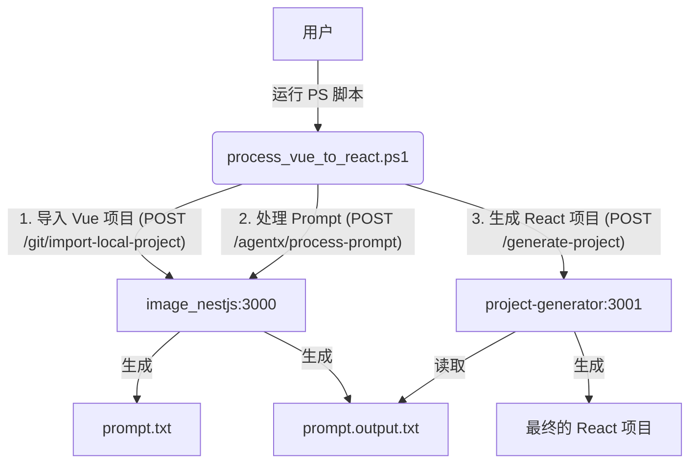

# Vue-to-React 自动化转换工具链

这是一个用于将 Vue 项目自动转换为 React 项目的工具链。该过程利用了两个 Node.js 后端服务和一个 PowerShell 脚本来协调整个流程。

## 架构概览

整个工作流程由三个核心组件构成：

1.  **`image_nestjs` (端口 3000)**: 一个基于 NestJS 的服务，负责：
    *   **项目导入**: 读取指定的本地 Vue 项目文件/目录，并将其内容聚合成一个单一的文本文件 (`prompt.txt`)。
    *   **AI 处理**: 调用外部或内部的 AI 服务 (AgentX/Dify) 来处理 `prompt.txt`，将 Vue 代码转换为 React 代码，并输出为 `prompt.output.txt`。

2.  **`project-generator` (端口 3001)**: 一个基于 Express 的简单服务，负责：
    *   **项目生成**: 解析 `prompt.output.txt` 文件中特定格式的文本，并根据文件路径和内容在指定的目录中动态生成完整的 React 项目结构。

3.  **`process_vue_to_react.ps1`**: 一个 PowerShell 核心脚本，负责：
    *   **流程编排**: 作为流程的入口点，按顺序调用 `image_nestjs` 和 `project-generator` 的 API，驱动整个转换过程。

### 工作流程



## 安装与设置

在运行此工具链之前，您需要分别设置并运行两个 Node.js 服务。

### 1. 设置 `image_nestjs` 服务

1.  **进入目录**:
    ```powershell
    cd image_nestjs
    ```

2.  **安装依赖**:
    ```powershell
    npm install
    ```

3.  **启动服务**:
    ```powershell
    npm run start:dev
    ```
    服务将在 `http://localhost:3000` 上运行。请保持此终端窗口的开启状态。

### 2. 设置 `project-generator` 服务

1.  **进入目录**:
    在另一个终端窗口中，进入 `project-generator` 目录。
    ```powershell
    cd project-generator
    ```

2.  **安装依赖**:
    ```powershell
    npm install
    ```

3.  **启动服务**:
    ```powershell
    node project-generator.js
    ```
    服务将在 `http://localhost:3001` 上运行。请保持此终端窗口的开启状态。

## 如何使用

当两个后端服务都成功运行后，您就可以使用 `process_vue_to_react.ps1` 脚本来执行转换。

1.  **打开一个新的 PowerShell 终端**。

2.  **导航到项目根目录**。

3.  **执行脚本**，并提供以下两个必需的参数：
    *   `VueFilePath`: 您要转换的 Vue 文件的绝对路径。
    *   `DestinationPath`: 您希望存放生成 React 项目的目录的绝对路径。

**示例命令:**

```powershell
./process_vue_to_react.ps1 -VueFilePath "C:\path\to\your\MyComponent.vue" -DestinationPath "C:\path\to\output"
```

执行后，脚本将：
1.  在项目根目录下生成 `prompt.txt`。
2.  接着生成 `prompt.output.txt`。
3.  最后，在 `C:\path\to\output` 目录下创建一个名为 `MyComponent.vue_react` 的 React 项目。

## 注意事项

*   **服务依赖**: 必须先启动 `image_nestjs` 和 `project-generator` 服务，然后才能运行 PowerShell 脚本。
*   **文件格式**: `project-generator` 依赖于 `prompt.output.txt` 中的特殊格式 `// File: path/to/file.txt` 来分隔和创建文件。如果 AI 服务输出的格式不正确，项目生成将失败。
*   **绝对路径**: 为避免路径问题，请在运行 PowerShell 脚本时为 `-VueFilePath` 和 `-DestinationPath` 参数提供绝对路径。
*   **错误处理**: 如果脚本在任何步骤失败，它将输出相关的错误信息。请检查对应的服务日志以获取更详细的调试信息。 


